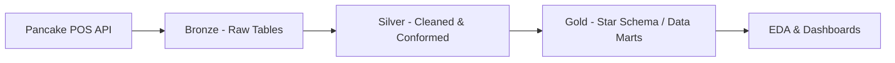
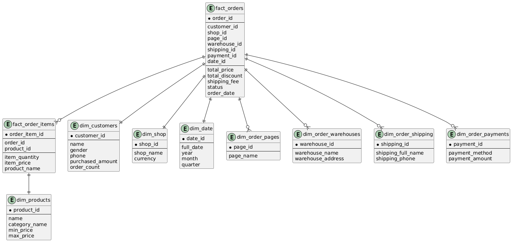
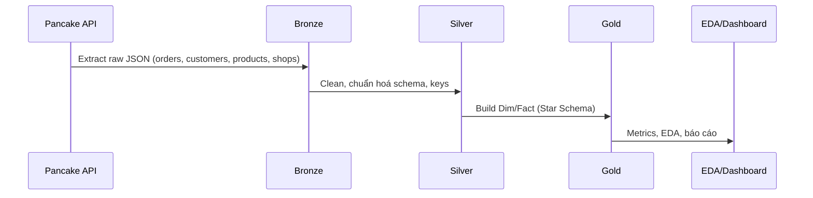

# Winner Group Analytics

## Giới thiệu

**Winner Group Analytics** là hệ thống phân tích dữ liệu bán hàng cho Winner Group (thời trang, bán hàng qua Facebook). Dự án thu thập dữ liệu từ **Pancake POS API**, xây dựng kho dữ liệu theo mô hình **Bronze → Silver → Gold**, và cung cấp báo cáo/EDA phục vụ ra quyết định.

## Tính năng nổi bật

- Thu thập dữ liệu từ Pancake POS API và lưu trữ vào MySQL (Bronze).
- Làm sạch, chuẩn hóa, chuẩn hoá khóa, và chuẩn bị Data Mart (Silver → Gold).
- Mô hình Star Schema cho phân tích: dim/fact, RFM, cohort, hành vi khách hàng.
- Notebook EDA chuyên đề cho Business Metrics và Customer Metrics.
- Tài liệu kỹ thuật, lineage, và RBAC SQL.

## Kiến trúc dữ liệu




### Star Schema (khái quát)



## Cấu trúc thư mục

```
winner_group_analytics/
├─ 1.Broze/                  # Bronze (Raw) – Notebooks lấy dữ liệu từ API
│  ├─ 0_TestPancakeAPI.ipynb
│  ├─ Customers.ipynb
│  ├─ Orders.ipynb
│  ├─ Products.ipynb
│  └─ Shop.ipynb
│
├─ 2.Silver/                 # Silver (Cleaned/Conformed)
│  ├─ Customers.ipynb
│  ├─ Orders.ipynb
│  ├─ Products.ipynb
│  ├─ Shop.ipynb
│  ├─ README.md
│  └─ Technical_Document/
│     ├─ Dictionary.xlsx
│     ├─ Fact&Dim.md
│     └─ StarSchema.png
│
├─ 3.Gold/                   # Gold (Data Marts / Star Schema)
│  ├─ 1_Clean_dim_customers.ipynb
│  ├─ 2_dim_date.ipynb
│  ├─ 3_Clean_dim_orders_pages.ipynb
│  ├─ 4_Clean_dim_order_payments.ipynb
│  ├─ 5_Clean_order_shipping.ipynb
│  ├─ 6_Clean_dim_order_warehouses.ipynb
│  ├─ 7_Clean_dim_products.ipynb
│  ├─ 8_Clean_fact_order_items.ipynb
│  ├─ 9_Clean_fact_orders.ipynb
│  └─ Technical_Document/
│     ├─ Gold_dictionary.xlsx
│     └─ Summary.md
│
├─ 4.EDA_Gold/               # EDA & phân tích ở tầng Gold
│  ├─ 1_Business_Metrics.ipynb
│  ├─ 2_Customer_Metrics.ipynb
│  └─ README.md
│
├─ 5.Dashboard/              # Dashboard (đang phát triển)
│
├─ 6.Docs/                   # Tài liệu & hình ảnh kỹ thuật
│  ├─ Takenote.md
│  └─ image/
│     ├─ 1.DataArchitecture.png
│     ├─ 2.DataLineage.png
│     ├─ 3.Dataflow.png
│     ├─ 4.StarSchema.png
│     └─ ERD.png
│
├─ SQL/
│  ├─ Guide_RBAC.sql
│  └─ RBAC.sql
│
├─ requirements.txt
├─ README.md
└─ LICENSE
```

## Công nghệ sử dụng

- **Python 3.10+**: Ngôn ngữ xử lý ETL/EDA.
- **MySQL**: Lưu trữ dữ liệu (OLTP/warehouse nhỏ).
- **Pandas/NumPy**: Xử lý dữ liệu.
- **Matplotlib/Seaborn/Plotly**: Trực quan hóa.
- **Jupyter Notebook**: Phát triển và trình bày phân tích.
- **SQLAlchemy, PyMySQL, python-dotenv**: Kết nối & cấu hình.

## Bắt đầu nhanh

### Yêu cầu hệ thống

- Python 3.10+ (khuyến nghị dùng `venv`).
- MySQL Server truy cập được (tài khoản có quyền tạo DB/tables).

### Cài đặt môi trường

```bash
python -m venv .venv
. .venv/Scripts/Activate.ps1   # Windows PowerShell
pip install -r requirements.txt
```

### Cấu hình biến môi trường

Tạo file `.env` ở thư mục gốc:

```bash
MYSQL_HOST=localhost
MYSQL_PORT=3306
MYSQL_DB=winner_group
MYSQL_USER=your_user
MYSQL_PASSWORD=your_password

PANCAKE_BASE_URL=https://api.pancake.vn
PANCAKE_API_TOKEN=your_token
```

### Chạy notebook

1. Mở Jupyter Lab/Notebook.
2. Chạy lần lượt notebook ở `1.Broze/` để kiểm tra kết nối API và đổ dữ liệu raw.
3. Thực hiện làm sạch/chuẩn hoá ở `2.Silver/`.
4. Xây dựng Dim/Fact ở `3.Gold/` và chạy EDA tại `4.EDA_Gold/`.

## Quy trình dữ liệu (ETL)



### Chuẩn hoá chính (ví dụ)

- Đồng nhất `id`/`*_id`, chuẩn hoá ngày (`order_date_id`), chuẩn kiểu dữ liệu.
- Chuẩn danh mục sản phẩm, map pages/shops, xử lý missing/duplicates.
- Tạo bảng sự kiện: `fact_orders`, `fact_order_items` và các `dim_*` liên quan.

## Hướng dẫn thư mục chính

- **1.Bronze/**: Kết nối Pancake API, kiểm thử tốc độ/trang, đổ dữ liệu raw.
- **2.Silver/**: Biến đổi dữ liệu thành dạng conformed, thiết kế Fact & Dim (`Technical_Document/`).
- **3.Gold/**: Thiết kế Star Schema cuối cùng và data mart phân tích.
- **4.EDA_Gold/**: Notebook EDA: Business Metrics, Customer Metrics.
- **5.Dashboard/**: Nơi triển khai dashboard (đang phát triển).
- **6.Docs/**: Ảnh kiến trúc, dataflow, lineage, ERD và ghi chú.
- **SQL/**: Quyền và vai trò (RBAC) cho môi trường dữ liệu.

## Bảo mật & Quyền truy cập (RBAC)

- Tham khảo `SQL/Guide_RBAC.sql` và `SQL/RBAC.sql` để cấp quyền phù hợp theo vai trò (reader/analyst/etl).

## Đóng góp

Đóng góp thông qua Pull Request:

- Tạo nhánh từ `main`, đặt tên có ý nghĩa.
- Mô tả rõ ràng thay đổi, ảnh hưởng dữ liệu/lược đồ nếu có.
- Đảm bảo notebook có thể chạy từ đầu đến cuối, ghi chú assumptions.

## Giấy phép

Phát hành theo giấy phép trong `LICENSE`.
